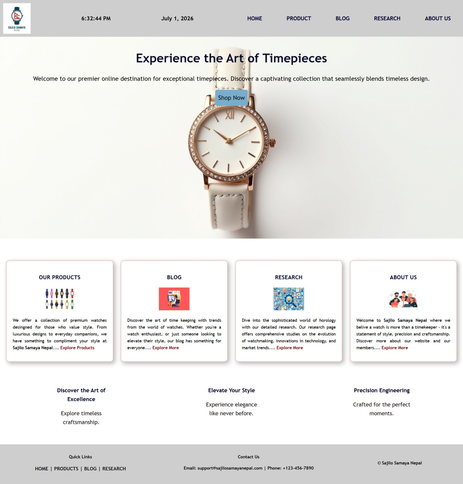
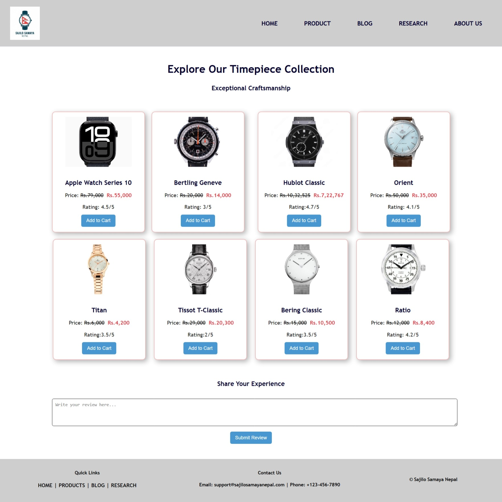
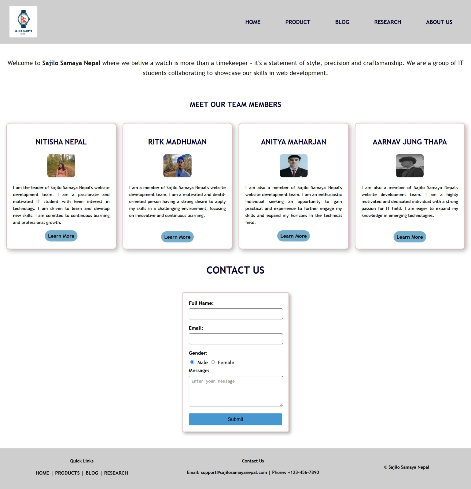
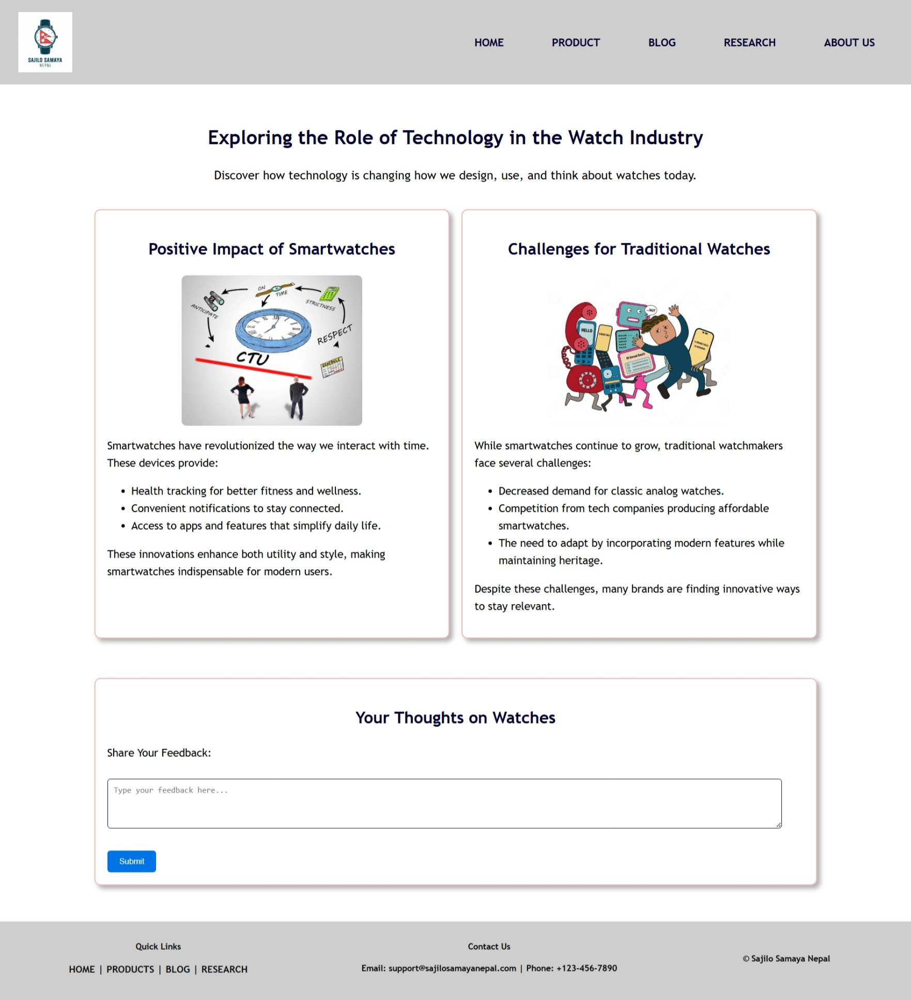
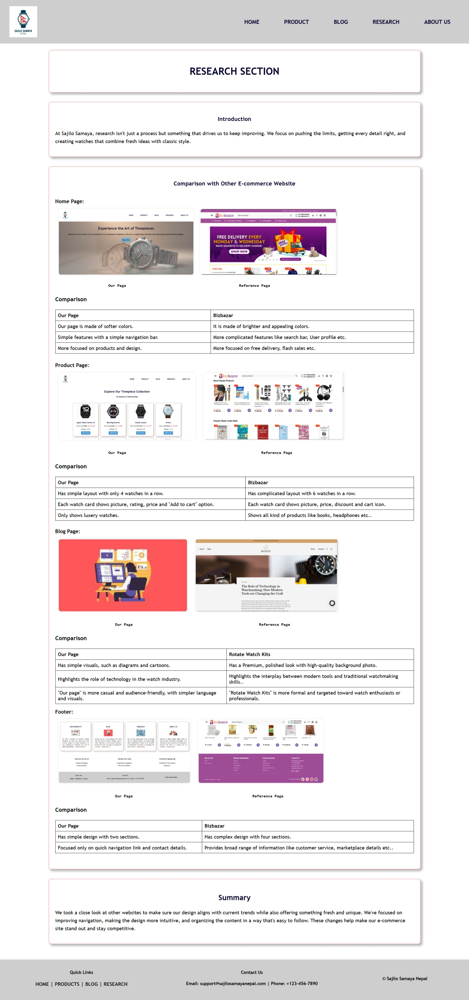

# ⌚ Luxury Watch Website

A responsive multi-page luxury watch website developed using **HTML**, **CSS**, and **JavaScript**. The project showcases a modern and elegant interface for exploring luxury watches while demonstrating front-end web development skills, responsive layouts, and user-friendly navigation.

---

## 📖 Overview

The **Luxury Watch Website** was developed as an academic team project to design and build a visually appealing and responsive website for a luxury watch brand. The website focuses on creating an engaging browsing experience through clean layouts, intuitive navigation, and attractive product presentation.

---

## ✨ Features

- 🏠 Responsive Home Page
- ⌚ Product Collection Page
- 📖 About Us Page
- 📰 Blog Page
- 🔬 Research Page
- 🧭 Responsive Navigation
- 🎨 Modern User Interface
- 📱 Mobile-Friendly Design

---

## 🛠️ Technologies Used

- HTML5
- CSS3
- JavaScript

---

## 📂 Project Structure

```text
Luxury-Watch-Website/
│
├── Images/
├── Screenshots/
├── css/
├── pages/
├── README.md
├── index.html
└── true.html
```

---

## 📸 Website Preview

### 🏠 Home Page



### ⌚ Products Page



### 📖 About Us



### 📰 Blog Page



### 🔬 Research Page



---

## 📚 Learning Outcomes

This project helped strengthen my understanding of:

- HTML5 page structure
- CSS styling and responsive web design
- JavaScript for interactive web elements
- Website navigation and user experience
- Front-end web development
- Team collaboration in web development projects

---

## 👥 Team

This project was developed collaboratively as part of an academic coursework project.

---

## 👩‍💻 Author

**Nitisha Nepal**

Computer Networking & IT Security Student

---

## 📄 License

This project was developed for educational purposes as part of academic coursework.
